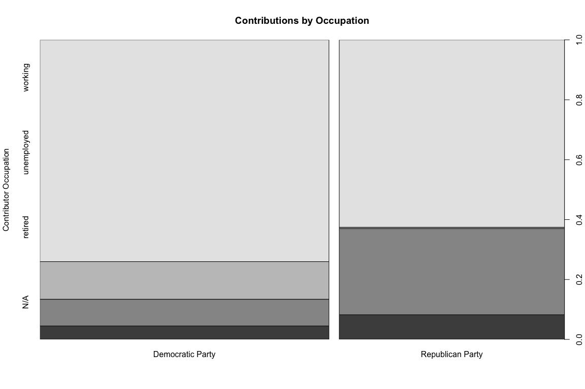

# Goal
The goal of this project was to perform exploratory data analysis on financial contributions from the state of California for the presidential campaign of 2016.  The report is contained [here] (https://github.com/ondramie/eda-prez-campaign-contributions-ca/blob/master/political_Contributions_CA2016g.md).  An explanatory portion is towards the end of the report and reproduced here under Final Plots. 

# Description of Files
File Name| Description
:--|:--
P00000001-CA.csv| Data Set of Individual Financial Contributions from California 
candidate-list.csv| Data Set of Candidate Information
zip_code_database.csv| Data Set of California by Zip Code
political_Contributions_CA2016g.Rmd| R Markdown Report with Code
political_Contributions_CA2016g.html | HTML version of Report (inaccessible due to size)
political_Contributions_CA2016g.md	| Markdown Report (referenced above)

Final Plots
=======================

### Plot One

### Description One

The histogram above identifies the trend of the distribution of net IFCs per contributor. This is engaging to a wide audience because it depicts the contribution tendencies of contributors, who can be any of us. Contributor's like to contribute in whole dollar amounts and in dollar amounts that are divisible by 10 or 5 for the most part. It also shows that most contributors will contribute the maximum legal amount ($2,700) eventually when a contributor can. Since the IFCs are grouped per contributor, the histogram shows the net of all of their contributions, not their contribution(s) on a particular day. This simple histogram allows the viewer to digest a lot of information about contributor tendencies. The perception is that the data would be normal around a mean, but the reality is that contributor's like whole numbers and contributing the most that they can eventually.

### Plot Two

### Description Two

A comparison is drawn among a contributor's occupation and the percentage of their contributions that make up the political party's contributions. This comparison is engaging to a wide audience because everybody knows at least one person who is retired, unemployed, or currently working, or who likes to remain anonymous. The identifying trends from this plot are that working contributors make up the bulk of contributions; that unemployed contributors make up more of a share of the Democratic Party's contributions than their Republican counterparts; and that retired and anonymous contributors make up more of a share of the Republican Party's contributions than their Democratic counterparts. The perception would be that contributors would contribute to political parties that benefit their interests. An argument can be made that the reality is that some contributors may not be contributing to political parties that may have their best interest.

### Plot Three

### Description Three

The comparison drawn in the plot above is the distribution of IFCs and the county of their contribution. The trend is that some counties contribute more than others. This is engaging to a wide audience because some people may have heard of these counties, or some may live in these counties, or some may know people who live in these counties. The perception is that the most populated counties might contribute the most on average, but the reality is that some of the smaller counties on average contribute more per the number of their county's contributions. The "x" in the box plots are the averages. These plots depict a lot of information concisely.
