About the Data
--------------

The data were exported from the website:

-   '<http://fec.gov/disclosurep/pnational.do>'

The data contain individual financial contributions, refunds to individuals and transfers from committees -- to date -- from the state of California to the 2016 United States of America presidential campaigns.

Variables in the Unmodified Data
--------------------------------

Detailed variable information of the data exists at:

-   '<ftp://ftp.fec.gov/FEC/Presidential_Map/2016/DATA_DICTIONARIES/CONTRIBUTOR_FORMAT.txt>'.

The unmodified data have 56,764 observations and 19 variables.

    ## [1] 56764    19

Most of the unmodified data is categorical. The variables "CONTB\_RECEIPT\_AMT" and "FILE\_NUM"" are the only numerics. For all intents and purposes, "FILE\_NUM" could be changed to a categorical variable, as no meaningful descriptive statistical data could be extracted from it as a numeric. An examination of the variables "CMTE\_ID," "CAND\_ID," and "CAND\_NM" reveals a degree of synonymity. Likewise, variables "TRAN\_ID," "FILE\_NUM," "FORM\_TP," "MEMO\_TEXT,"" and "MEMO\_CD" seem to be linked to Federal Election Commission (FEC) internal information.

    ## Classes 'tbl_df', 'tbl' and 'data.frame':    56764 obs. of  19 variables:
    ##  $ cmte_id          : Factor w/ 21 levels "C00458844","C00500587",..: 7 7 7 7 7 7 7 7 7 1 ...
    ##  $ cand_id          : Factor w/ 21 levels "P00003392","P20002721",..: 10 10 10 10 10 10 10 10 10 9 ...
    ##  $ cand_nm          : Factor w/ 21 levels "Bush, Jeb","Carson, Benjamin S.",..: 17 17 17 17 17 17 17 17 17 16 ...
    ##  $ contbr_nm        : Factor w/ 24895 levels "A DOSS, CANDALON",..: 5436 8076 8120 8262 16036 16049 16113 10769 10799 19940 ...
    ##  $ contbr_city      : Factor w/ 1022 levels "","29 PALMS",..: 794 39 174 791 613 110 38 791 828 505 ...
    ##  $ contbr_st        : Factor w/ 1 level "CA": 1 1 1 1 1 1 1 1 1 1 ...
    ##  $ contbr_zip       : Factor w/ 21215 levels "","00000","11205",..: 14807 19762 5938 7509 16599 5657 4141 7356 18357 2567 ...
    ##  $ contbr_employer  : Factor w/ 9407 levels ""," APPLE INC.",..: 206 5791 5791 7323 5791 5791 5791 8753 5791 2816 ...
    ##  $ contbr_occupation: Factor w/ 4464 levels "",".COM EXECUTIVE",..: 3842 2615 2615 3601 2615 2615 3427 2489 2615 3294 ...
    ##  $ contb_receipt_amt: num  50 100 1000 5 196 ...
    ##  $ contb_receipt_dt : Factor w/ 274 levels "01-APR-15","01-AUG-15",..: 93 170 170 170 189 170 170 52 52 215 ...
    ##  $ receipt_desc     : Factor w/ 22 levels "","2016 SENATE PRIMARY DONOR REDESIGNATION FROM PRIMARY",..: 1 1 1 1 1 1 1 1 1 1 ...
    ##  $ memo_cd          : Factor w/ 2 levels "","X": 1 1 1 1 1 1 1 1 1 1 ...
    ##  $ memo_text        : Factor w/ 88 levels "","*","* EARMARKED CONTRIBUTION: SEE BELOW",..: 3 3 3 3 1 3 3 3 3 1 ...
    ##  $ form_tp          : Factor w/ 3 levels "SA17A","SA18",..: 1 1 1 1 1 1 1 1 1 1 ...
    ##  $ file_num         : int  1029414 1029414 1029414 1029414 1029414 1029414 1029414 1029414 1029414 1029436 ...
    ##  $ tran_id          : Factor w/ 56511 levels "A000771210424405B8CF",..: 47278 48223 48147 48200 50425 48204 48202 46887 46898 37882 ...
    ##  $ election_tp      : Factor w/ 5 levels "","G2016","O2016",..: 4 4 4 4 4 4 4 4 4 4 ...
    ##  $ X                : logi  NA NA NA NA NA NA ...

Exploratory Data Analysis
=========================

### Summarizing the unmodified dataset

The minimum Individual Financial Contribution (IFC) from California (CA) was $-10K. A summary of IFC statistics is below:

    ##     Min.  1st Qu.   Median     Mean  3rd Qu.     Max. 
    ## -10000.0     35.0    100.0    474.1    250.0  10800.0

The negative $10K contribution was a refund based on the receipt description. Here she is:

    ## Source: local data frame [1 x 19]
    ## 
    ##     cmte_id   cand_id             cand_nm      contbr_nm contbr_city
    ##      (fctr)    (fctr)              (fctr)         (fctr)      (fctr)
    ## 1 C00573519 P60005915 Carson, Benjamin S. HARRIS, CAROLE      SANGER
    ## Variables not shown: contbr_st (fctr), contbr_zip (fctr), contbr_employer
    ##   (fctr), contbr_occupation (fctr), contb_receipt_amt (dbl),
    ##   contb_receipt_dt (fctr), receipt_desc (fctr), memo_cd (fctr), memo_text
    ##   (fctr), form_tp (fctr), file_num (int), tran_id (fctr), election_tp
    ##   (fctr), X (lgl)

Other negative IFCs in the data were refunds, re-designation, and re-attributions -- among others. The negative IFCs affect the mean and the standard deviation or variance but not the median and the quantiles. As a result, I do not try to emphasize means or standard deviations herein. Other statistics from this IFC summary were the maximum IFC ($10.8K), along with the first quantile ($35), the median ($100), and the third quantile ($250). The refund for the negative 10K contribution is below:

    ## Source: local data frame [1 x 4]
    ## 
    ##   receipt_desc  contbr_employer                        memo_text
    ##         (fctr)           (fctr)                           (fctr)
    ## 1              HARRIS FARMS INC REFUNDED $10000.00 ON 09/09/2015
    ## Variables not shown: contbr_occupation (fctr)

A table of the multiple contributors who contributed the maximum IFCs is below:

    ## Source: local data frame [12 x 3]
    ## 
    ##    contb_receipt_amt            contbr_nm                   cand_nm
    ##                (dbl)               (fctr)                    (fctr)
    ## 1              10800           MUTH, RICK             Walker, Scott
    ## 2              10800       HERBERT, GAVIN             Walker, Scott
    ## 3              10800      MILLER, MICHAEL             Walker, Scott
    ## 4              10800      HOROWITZ, DAVID             Walker, Scott
    ## 5              10800 NELSON, SUZANNE MRS. Cruz, Rafael Edward 'Ted'
    ## 6              10800     BERGSTEIN, DAVID Cruz, Rafael Edward 'Ted'
    ## 7              10800    SALIMPOUR, PEJMAN Cruz, Rafael Edward 'Ted'
    ## 8              10800       DE GROTE, DOUG Cruz, Rafael Edward 'Ted'
    ## 9              10800  DE GROOTE, DOUG MR. Cruz, Rafael Edward 'Ted'
    ## 10             10800 NELSON, SUZANNE MRS. Cruz, Rafael Edward 'Ted'
    ## 11             10800    SALIMPOUR, PEJMAN Cruz, Rafael Edward 'Ted'
    ## 12             10800     BERGSTEIN, DAVID Cruz, Rafael Edward 'Ted'

Twelve IFCs at the maximum amount ($10,800) exist, some of which are duplicate. These were all re-attributed or re-designated per the memo text and receipt description, possibly to the national party committee. The duplicate IFCs of $10,800, given on the same date, by the same contributor seem very odd. A summary of everything else is here:

    ##       cmte_id           cand_id                           cand_nm     
    ##  C00575795:15980   P00003392:15980   Clinton, Hillary Rodham  :15980  
    ##  C00577130:14620   P60007168:14620   Sanders, Bernard         :14620  
    ##  C00573519: 7826   P60005915: 7826   Carson, Benjamin S.      : 7826  
    ##  C00574624: 6675   P60006111: 6675   Cruz, Rafael Edward 'Ted': 6675  
    ##  C00458844: 3102   P60006723: 3102   Rubio, Marco             : 3102  
    ##  C00577312: 2299   P60007242: 2299   Fiorina, Carly           : 2299  
    ##  (Other)  : 6262   (Other)  : 6262   (Other)                  : 6262  
    ##               contbr_nm            contbr_city    contbr_st 
    ##  IMEOKPARIA, OSI   :   52   LOS ANGELES  : 4082   CA:56764  
    ##  BATTS, ERIC       :   43   SAN FRANCISCO: 3747             
    ##  BUCCHERE, CHRIS   :   41   SAN DIEGO    : 1887             
    ##  HANNON, STEPHANIE :   40   SAN JOSE     : 1167             
    ##  PAULISSIAN, MARTHA:   40   OAKLAND      :  921             
    ##  OFTEDAL, EGIL MR. :   37   SACRAMENTO   :  775             
    ##  (Other)           :56511   (Other)      :44185             
    ##      contbr_zip         contbr_employer              contbr_occupation
    ##  920274404:   56   RETIRED      :10028   RETIRED              :12059  
    ##  943061338:   52   NOT EMPLOYED : 5473   NOT EMPLOYED         : 4713  
    ##  913565823:   46   SELF-EMPLOYED: 4784   ATTORNEY             : 1947  
    ##  958256321:   44   N/A          : 3035   HOMEMAKER            : 1436  
    ##  941311708:   43   SELF EMPLOYED: 2129   INFORMATION REQUESTED: 1217  
    ##  949601336:   41   (Other)      :31233   (Other)              :35380  
    ##  (Other)  :56482   NA's         :   82   NA's                 :   12  
    ##  contb_receipt_amt   contb_receipt_dt                     receipt_desc  
    ##  Min.   :-10000.0   30-SEP-15: 3279                             :55408  
    ##  1st Qu.:    35.0   30-JUN-15: 1665   Refund                    :  349  
    ##  Median :   100.0   29-SEP-15: 1305   REDESIGNATION TO GENERAL  :  258  
    ##  Mean   :   474.1   23-SEP-15:  982   REDESIGNATION FROM PRIMARY:  254  
    ##  3rd Qu.:   250.0   15-SEP-15:  924   REATTRIBUTION FROM SPOUSE :   94  
    ##  Max.   : 10800.0   28-SEP-15:  878   REATTRIBUTION TO SPOUSE   :   94  
    ##                     (Other)  :47731   (Other)                   :  307  
    ##  memo_cd                                 memo_text      form_tp     
    ##   :55539                                      :42982   SA17A:56161  
    ##  X: 1225   * EARMARKED CONTRIBUTION: SEE BELOW:12193   SA18 :  254  
    ##            EARMARKED FROM MAKE DC LISTEN      :  387   SB28A:  349  
    ##            REDESIGNATION TO GENERAL           :  258                
    ##            REDESIGNATION FROM PRIMARY         :  254                
    ##            REATTRIBUTION FROM SPOUSE          :   94                
    ##            (Other)                            :  596                
    ##     file_num              tran_id      election_tp      X          
    ##  Min.   :1003942   SA17.300674:    3        :   49   Mode:logical  
    ##  1st Qu.:1024052   SA17.365962:    3   G2016:  951   NA's:56764    
    ##  Median :1029414   C1013462   :    2   O2016:  281                 
    ##  Mean   :1026768   C1015104   :    2   P2016:55482                 
    ##  3rd Qu.:1029462   C1015363   :    2   P2018:    1                 
    ##  Max.   :1029674   C1015437   :    2                               
    ##                    (Other)    :56750

The summary above tells me a couple things. Hillary Clinton has the highest number of contributions. Democrats have the highest number of contributions. The contributor OSI IMEOKPARIA has the highest number of contributions. Los Angeles City seems to be the leading city for number of contributions. Retired people seem to have the highest number of contributions more than any other occupation.

### Merging Datasets and Insights

I decided to add some more data and merge a couple data sets to the data set above:

-   'candidate-list.csv'

-   'zip\_code\_database.csv'

The first file above was taken from the same source as the original data set. The second file above was taken from:

-   <http://www.unitedstateszipcodes.org/zip-code-database/>

The data set mergers resulted in a data frame with following number of observations and features:

    ## [1] 56746    39

Some variables of import resulted from the mergers: the *gender* of the political candidates, the *politcal affiliation* of the political candidates, and the *counties* of the contributors. 58 counties exist within California, whereas 41,746 zip-codes exist within California. 58 counties is more manageable from an examination standpoint.

Utilizing these new variables, I determined that the minimum IFC of -10K was from Fresno County and for the presidential hopeful Ben Carson, a Republican. The IFC was refunded to the contributor, who is the owner of Harris Farms Inc, from which the famed Harris Beef might originate. The vast majority of IFCs are around $100 (9,356), the cash maximum, and $2700 (5,978) the IFC maximum.

### Histograms of IFCs

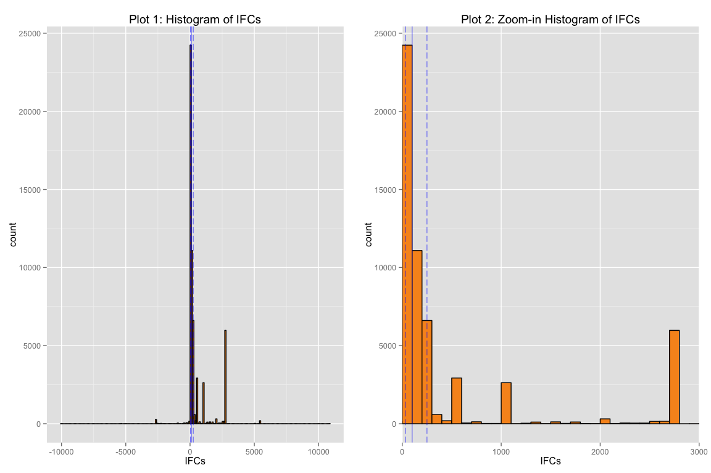

Histogram plot (1) of the IFCs reveals a potential multimodal distribution. Maybe, perhaps, an FEC maximum IFC exists around the peak between $2K and $3K. A search produced the following FEC mandates:

-   $2,700 per election to a Federal candidate or the candidate's campaign committee

-   $5,000 per calendar year to a Political Action Committee (PAC)

-   $10,000 per calendar year to a State or local party committee

-   $34,400 per calendar year to a national party committee

-   $100 in currency (cash) to any political committee, with anonymous cash contributions not exceeding $50

This seems to provide an explanation for why a discrete multimodal distribution exists. Histogram plot (2) is a zoom in of plot (1). Blue line is median, and dashed blue lines are 25% and 75% quantiles. The time has come to facet:

Facet plot (3) shows more IFCs for male candidates than for female candidates. This is not surprising since the number of women in the presidential race is two. Facet plot (3) shows more IFCs for the Democratic Party. This is not surprising based on the descriptive summary above. The distribution of IFCs shows the stark difference in money between the two candidates who are women.

Facet plot (4) shows the number of IFC are greatest for the election form P2016, the primary of 2016. The other forms are G2016, O2016, NaN, and P2018. "G" stands for General; "O" stands for other. Most of the counts are going into the primary of 2016. A case could be made for reducing the data to only P2016.

Facet Plot (5) shows the data more like a bathtub distribution. The peaks seem for the most part at the maximum-allowed-cash IFC and allowed-maximum IFC per year. A notable exception are the 1K contributions.

 

Kernel density plot (6) and q-q plot (7) of IFCs seems to corroborate with multimodal distribution and non-linearity assumption .

Log transformation plot (8) and sine-log transformation plot (9) of IFCs seems to make the distribution look more symmetric. The X-axes of plots (8,9) are different; the negative IFC values are more apparent in these plots.

County Information
------------------

 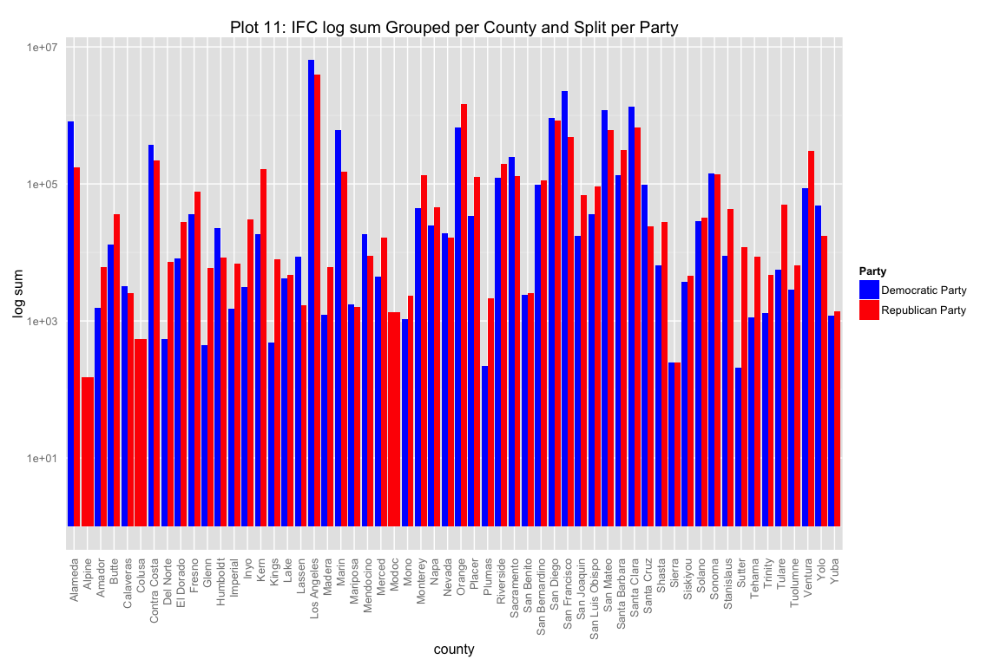 

Plot (10) shows IFC log counts grouped per county and split by party. The number of IFCs depends on the county. Plot (11) shows IFC log summations grouped per county and split by party. The summation of IFCs depends on the county. Plot (12) shows IFC log variance grouped per county and split by party. Visually on plot 12, the Republican party seems to have a greater variance of contributions, in general. Data from Plot (10) show some counties [ Alpine, Colusa, and Modoc ] made no IFCs for Democratic Party. Sierra county made contributions, but the log scale obscures this.

I can see that the most populated county in California, the Los Angeles County, has the most counts for both Democratic and Republican candidates. A quick query reveals that the IFC sum for the Democratic Party in Los Angeles is the largest. This seems to be consistent with the previous bar charts. Another query into the minimum sum IFC per county is $150 with a median IFC of $50 and a count of 3. Alpine county, which happens to be the least populated county in California, has the distinction of these statistics. Candidate data is what follows:

### Candidate Information

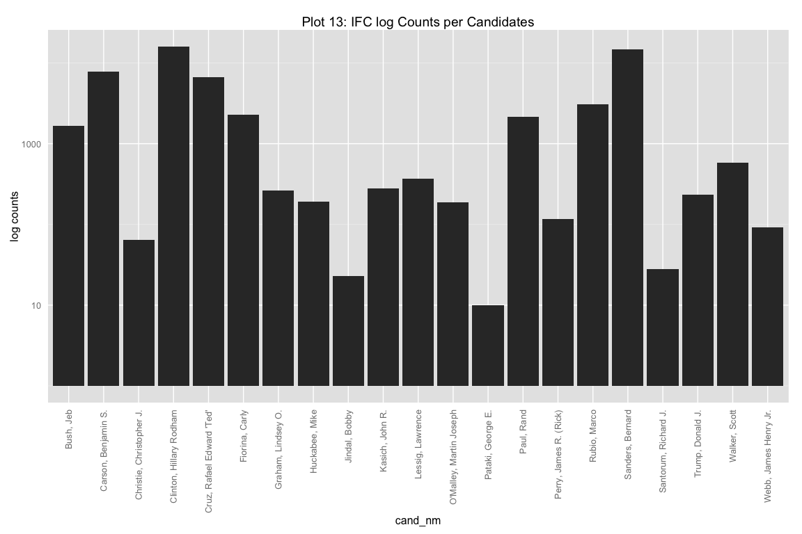  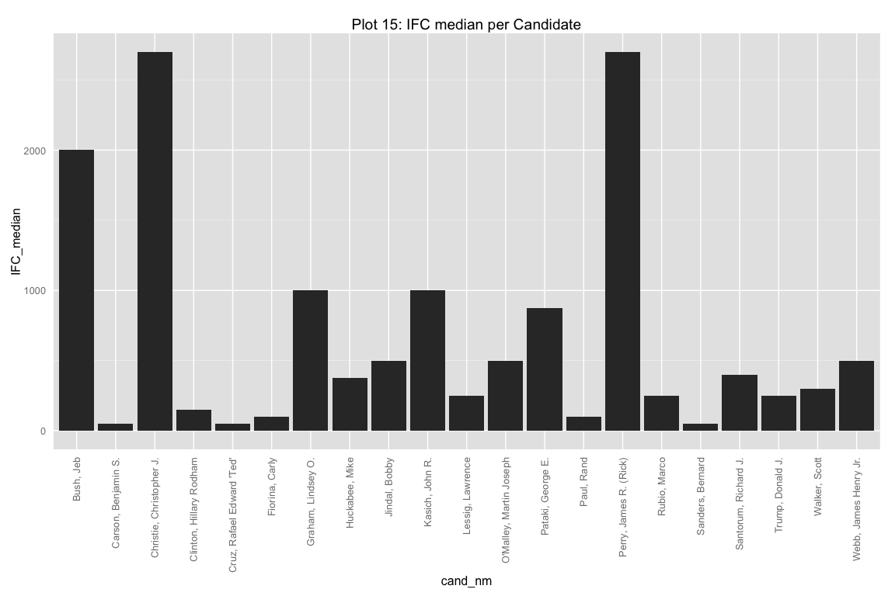

Plot (13) shows counts per candidates. Plot (13) shows Hillary Rodham Clinton in the lead with Bernard Sanders in second. For the Republican party, Ben Carson seems to have the most counts with Ted Cruz in second. Plot (14) shows IFC summations per candidate. For the Democrats, Clinton is in the lead here too, whereas for the Republicans, Bush is in the lead. This tells me that number of contributions doesn't correspond to summation of contributions. Plot (15) shows IFC median per candidate. Rick Perry and Chris Christie seems on average to have the highest median amount of money contributed. Bernie Sanders, Ted Cruz, and Ben Carson have the lowest. Temporal data is what follows next:

### Contribution Receipt Information

  

Plot (16) shows a peak around the 30th of September, which is when South Carolina finalizes the ballot for the primary. By recasting the receipt dates into date class and adjusting the bin width, the re-plot of the counts of IFC receipt dates shows a steady increase of counts with time with a peak during the month of September, corroborating with the previous plot. More people are contributing as the primary approaches.

### Data clean-up due to Negative IFCs

Some data clean-up was attempted to reduce the number of variables and extraneous data:

-   Elimination of negative contributions and corresponding positive contributions that were labeled as such or gleaned from an examination of other variables within the selected subset of the data set.

-   Data that had a degree of synonymity or redundancy

-   Data not pertinent to the initial data set in order to keep scope within the prescribed data set choice and reduce project ambiguity.

Only 10 variables are of import from the merged data sets. They are: cand\_nm, contbr\_nm, contbr\_city, contbr\_employer, contbr\_occupation, contb\_receipt\_amt, contb\_receipt\_dt, cand\_pty\_aff, sex, and county. I believe that I created a tiddy dataframe, which is called pres\_df.clean.

After trying to manipulate the data set to remove negative IFCs and their corresponding positive IFCs, I discovered that some of the negative IFCs had no corresponding positive IFCs and that some of the negative IFCs had different receipt dates, making matching difficult. I grouped by contributor and summed up their contributions to try to reconcile negative IFCs.

Grouping the data by contributor's name and then determining his or hers net contributed IFC, I discovered that 96 contributors had a net negative IFC, meaning that their net contribution was negative -- somehow. The average negative contribution was -$1,452; the maximum negative contribution was -$14.35; and the minimum negative contribution was -$5,400. Similarly, I discovered that 91 contributors had a net zero IFC. For comparison purposes, 24,886 unique contributors exist. I eliminated amounts less than or equal to zero.

A histogram plot (20) of net IFCs produced results that differed from the histogram of IFCs produced earlier (plot (1,2)). Notably, the peak IFCs are different. The mode IFC for the histogram that was produced earlier was $25, whereas the mode IFC for the histogram that was produced with net IFCs seems equal to $2,700. The statistics are also different. The statistics from this summary are the following: the maximum net IFC ($21.6K), the first quantile ($244), the median ($500), and the third quantile ($2,633). These results seem more in line with the FEC rules. The results here convey that the statistics are greater when grouped per the contributor's net contribution than when not grouping per the contributor's individual contribution. Plot (21) is a log transformation of net IFCs per contributor. The data seem more symmetric.

### Occupation and Employment of Contributor Information

Below is bar chart of the occupations of the contributors and the employers of the contributors. The plots are samples of the population. The population is too big to depict on the x-axis with ~9,407 employers and ~4,464 occupations.

 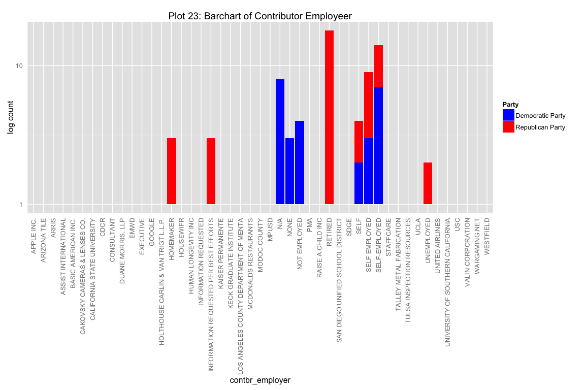

Seeing too many categories for occupations, I reduced the categories to four: N/A, retired, unemployed, and working. Retired peoples of CA contribute more to Republican candidates, both in quantity and contribution. This is a surprise to me. Unemployed and working peoples contribute more to Democratic candidates than Republican candidates. Doing the same plot for employers seems redundant to me.

### Box Plot - Gender, Party, Gender Information

    ## $`Democratic Party`
    ##    Min. 1st Qu.  Median    Mean 3rd Qu.    Max. 
    ## -5400.0    35.0   100.0   510.9   300.0 10000.0 
    ## 
    ## $`Republican Party`
    ##     Min.  1st Qu.   Median     Mean  3rd Qu.     Max. 
    ## -10000.0     40.0    100.0    428.7    250.0  10800.0

    ## $female
    ##    Min. 1st Qu.  Median    Mean 3rd Qu.    Max. 
    ## -5400.0    50.0   140.0   795.7  1350.0  5400.0 
    ## 
    ## $male
    ##     Min.  1st Qu.   Median     Mean  3rd Qu.     Max. 
    ## -10000.0     35.0    100.0    321.1    250.0  10800.0

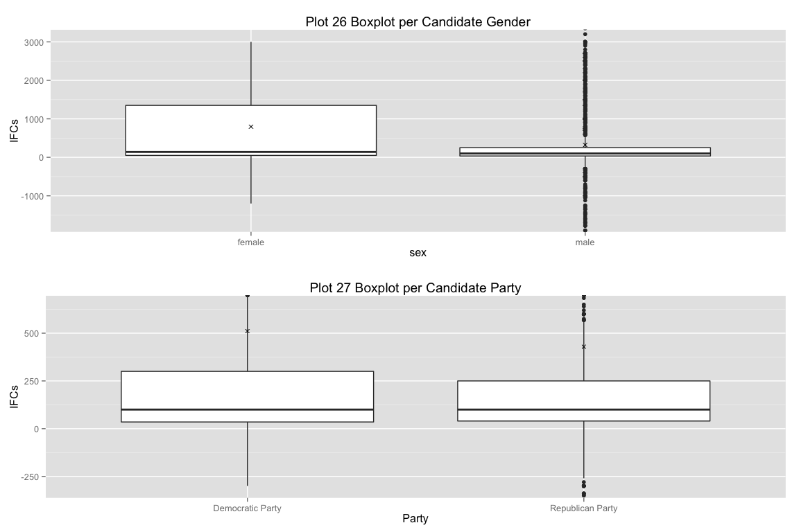

Summary statistics and box plots of IFCs per gender or party are presented above.

The median IFC per candidate party appear the same ($100), although the interquantile range seems to be greater for the Democratic Party than for the Republican party, whereas the range seems to be greater for the Republican Party than for the Democratic Party.

The median IFC per candidate gender is greater for female candidates ($140) than male candidates ($100). The IFC interquantile range seems smaller for males candidates than female candidates. The IFC range is greater for male candidates than female candidates.

Outliers seem more prevalent for male candidates or for Republican Party candidates than for female candidates or for Democratic candidates. These box plots are not of counts but of IFCs. On average, female candidates seem to get higher IFCs than their male counterparts. This seems skewed do to the Hilary contributions.

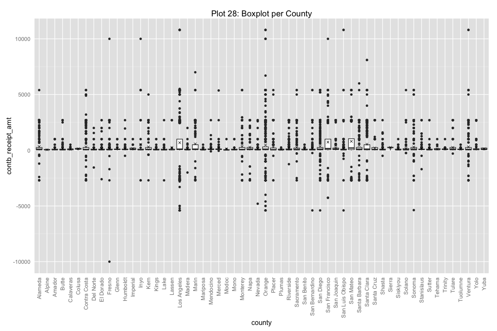 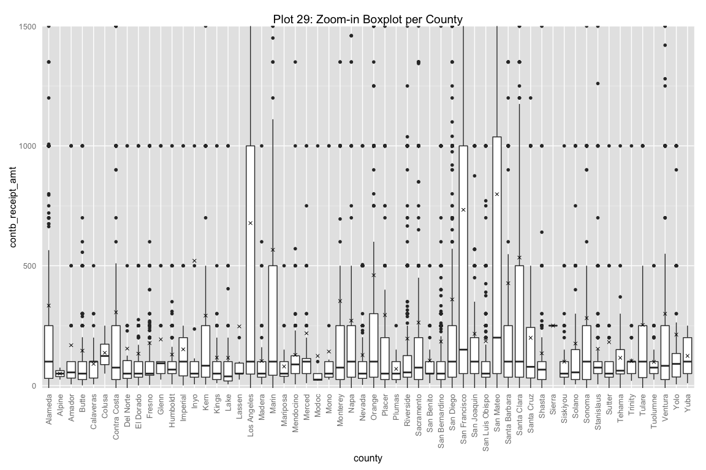

Summary statistics of IFCs per county are presented above. The LA County, SF County, and San Mateo County have greater interquantile ranges than other counties. San Mateo seems to have the highest median IFC.

Box plot of occupation shows people who remain anonymous (N/A) on average contribute more. The lowest contributions come from the unemployed.

### Nominal, Continuous Bivariate

#### IFCs vs. Time

 

Plot (30) shows IFC versus contribution date, excluding IFCs equal to zero. Fourteen (14) IFCs were zero. The variance seems to be increasing with time. The 2-D histogram shows that a peak between +250 and -250.

Plot (31) shows IFC net sums grouped by date, excluding IFC sums equal to zero. I have no explanation for what seems like a mostly positive net sum IFC versus contribution date for the plot 2. I cannot fathom why FEC accounting practices would possibly choose to ensure that a net positive IFC exists for each day a contribution was given.

Plot (32) shows IFC net sums grouped by contributor with the date of their most recent contribution, excluding IFC sums equal to zero. Time data is discrete for both plots. Plot 3 has striations around contribution limits. Some over-plotting seems to exist for the plot (32). The 2D histogram shows the striations more abruptly.

Plot (33) has an over-plotting correction, revealing striations of data between $5,000 and $100. Most of the data is below $5,000. Plot (34) has a more aggressive over-plotting correction with induced jitter and breaks per FEC limits, revealing more over-plotting between July and October 2015 and between $700 and $0. Jitter was used due to class time data having multiple intervals such as date,time, and date and time. Perhaps IFCs were tallied at the end of the day. A closer examination with plot (35) of the over-plotted area looks to shows that most of the net IFCs are given in $50 increments. It seems contributors give money in multiples of 50. Plot (36) takes the square root of IFS sums, revealing data below $50, which wasn't visible until now.

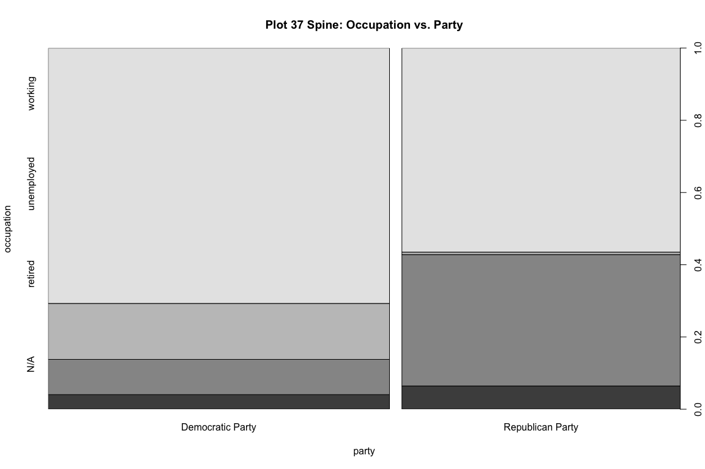 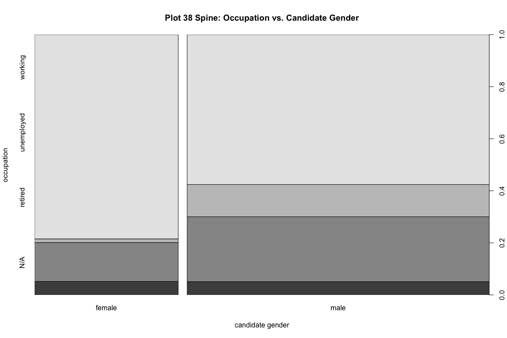

Spine plot (37) shows that working peoples are responsible for the majority of contributions to both parties. A huge difference exists among unemployed and retired peoples and the percentage of their contributions that make up the parties. Spine plot (38) shows working peoples make up the majority of contributions as well for male or female candidates. Seems like the unemployed make up more of the share of male candidate's contributions.

Multivariate Plots
------------------

I wanted to see if there was any delineation of features with time. Are the IFCs in different strata when it comes to counties, candidates, gender, and party with respect to time?

 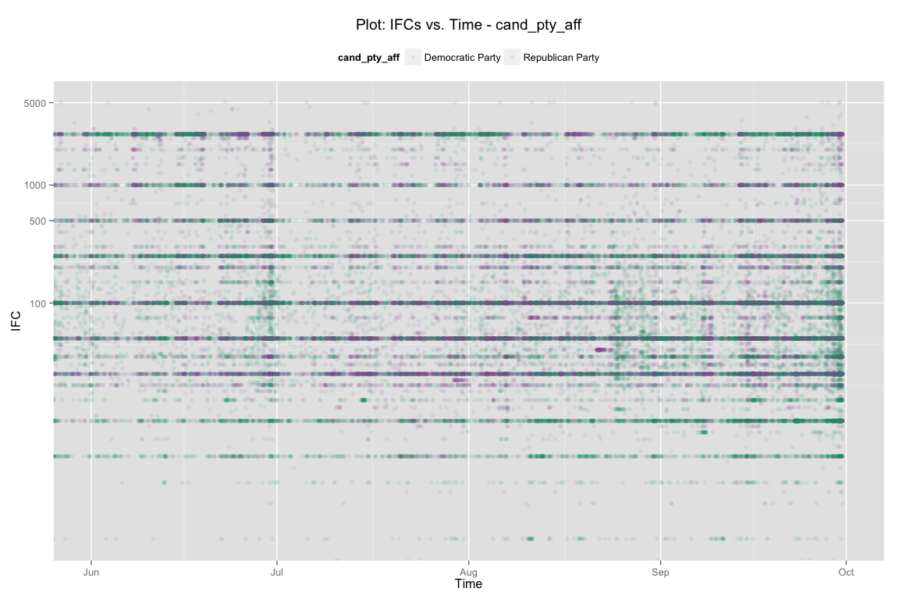 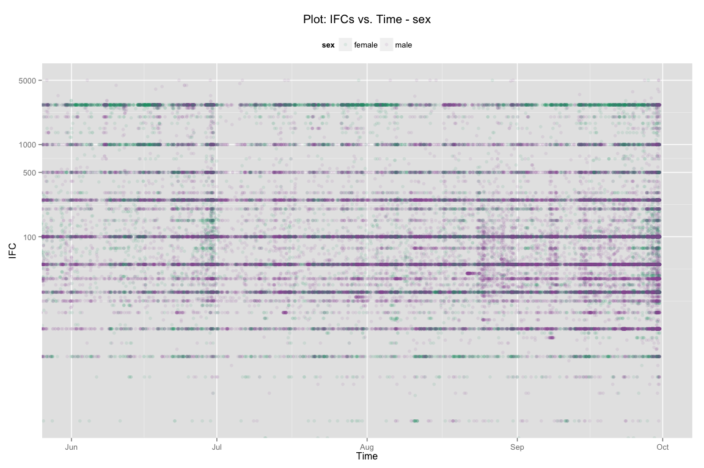 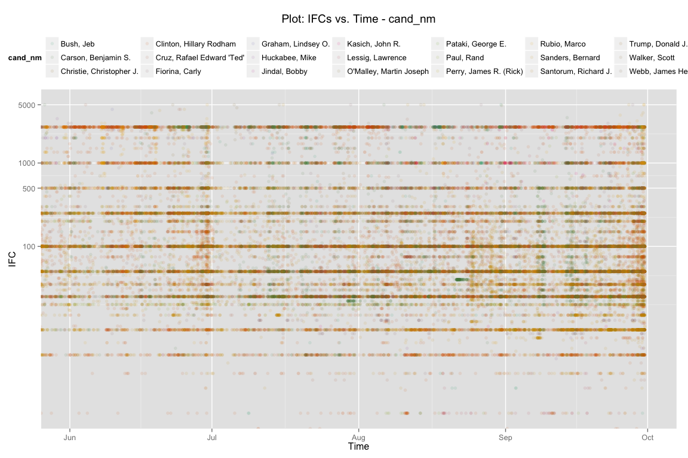 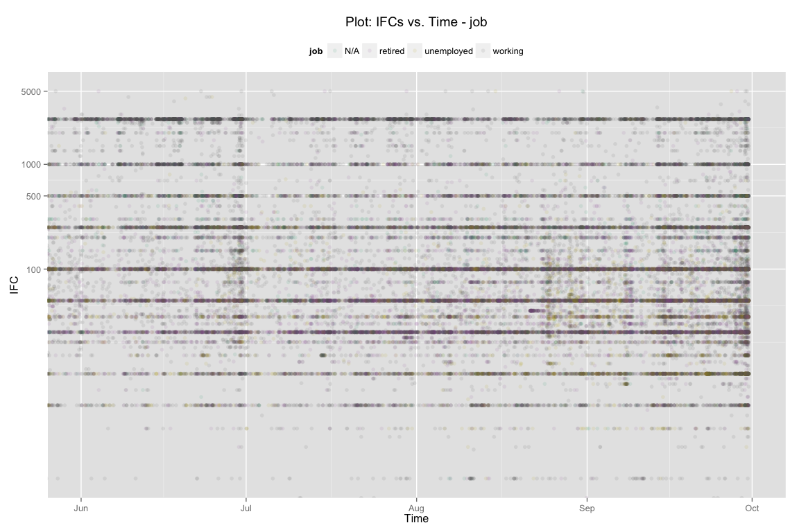 I don't see anything discernible with the time plots.

 The plot shows Hillary and Bernie having a lot more data than the others. It also looks like certain occupations are investing in Bernie, Hilary, and the Republicans. Buckets are very noticeable in this plot. These support the contribution buckets or striations witnessed in other plots, and the findings that were found in the spline plots. Next, I wanted to see the density of the IFCs overlaid on top of each other. Perhaps, there is a convolution of distributions.

    ## [[1]]

    ## 
    ## [[2]]
    ## pres_df.clean[, feature]: Alameda
    ##    Min. 1st Qu.  Median    Mean 3rd Qu.    Max. 
    ## -2700.0    30.0   100.0   333.6   250.0  5400.0 
    ## -------------------------------------------------------- 
    ## pres_df.clean[, feature]: Alpine
    ##    Min. 1st Qu.  Median    Mean 3rd Qu.    Max. 
    ##    25.0    37.5    50.0    50.0    62.5    75.0 
    ## -------------------------------------------------------- 
    ## pres_df.clean[, feature]: Amador
    ##    Min. 1st Qu.  Median    Mean 3rd Qu.    Max. 
    ##    5.00   31.25   55.00  168.30  100.00 1000.00 
    ## -------------------------------------------------------- 
    ## pres_df.clean[, feature]: Butte
    ##    Min. 1st Qu.  Median    Mean 3rd Qu.    Max. 
    ##     1.0    25.0    50.0   145.5   100.0  2700.0 
    ## -------------------------------------------------------- 
    ## pres_df.clean[, feature]: Calaveras
    ##    Min. 1st Qu.  Median    Mean 3rd Qu.    Max. 
    ##    5.00   31.50  100.00   90.55  100.00  500.00 
    ## -------------------------------------------------------- 
    ## pres_df.clean[, feature]: Colusa
    ##    Min. 1st Qu.  Median    Mean 3rd Qu.    Max. 
    ##    50.0    87.5   123.5   136.8   172.8   250.0 
    ## -------------------------------------------------------- 
    ## pres_df.clean[, feature]: Contra Costa
    ##    Min. 1st Qu.  Median    Mean 3rd Qu.    Max. 
    ## -2700.0    25.0    75.0   305.9   250.0  5400.0 
    ## -------------------------------------------------------- 
    ## pres_df.clean[, feature]: Del Norte
    ##    Min. 1st Qu.  Median    Mean 3rd Qu.    Max. 
    ## -1550.0    30.0    50.0   154.4   104.0  2000.0 
    ## -------------------------------------------------------- 
    ## pres_df.clean[, feature]: El Dorado
    ##    Min. 1st Qu.  Median    Mean 3rd Qu.    Max. 
    ## -2600.0    35.0    50.0   133.1   100.0  2700.0 
    ## -------------------------------------------------------- 
    ## pres_df.clean[, feature]: Fresno
    ##     Min.  1st Qu.   Median     Mean  3rd Qu.     Max. 
    ## -10000.0     43.0     50.0    177.2    100.0  10000.0 
    ## -------------------------------------------------------- 
    ## pres_df.clean[, feature]: Glenn
    ##    Min. 1st Qu.  Median    Mean 3rd Qu.    Max. 
    ##   25.00   50.00   92.86  192.70  100.00 1000.00 
    ## -------------------------------------------------------- 
    ## pres_df.clean[, feature]: Humboldt
    ##    Min. 1st Qu.  Median    Mean 3rd Qu.    Max. 
    ## -500.00   50.00   66.68  129.40  100.00 2700.00 
    ## -------------------------------------------------------- 
    ## pres_df.clean[, feature]: Imperial
    ##    Min. 1st Qu.  Median    Mean 3rd Qu.    Max. 
    ##     1.0    40.5   100.0   151.2   200.0  1000.0 
    ## -------------------------------------------------------- 
    ## pres_df.clean[, feature]: Inyo
    ##    Min. 1st Qu.  Median    Mean 3rd Qu.    Max. 
    ## -2700.0    35.0    50.0   520.6   100.0 10000.0 
    ## -------------------------------------------------------- 
    ## pres_df.clean[, feature]: Kern
    ##    Min. 1st Qu.  Median    Mean 3rd Qu.    Max. 
    ##   -2700      35      83     292     250    5000 
    ## -------------------------------------------------------- 
    ## pres_df.clean[, feature]: Kings
    ##    Min. 1st Qu.  Median    Mean 3rd Qu.    Max. 
    ##    10.0    25.0    50.0   116.7   100.0  1000.0 
    ## -------------------------------------------------------- 
    ## pres_df.clean[, feature]: Lake
    ##     Min.  1st Qu.   Median     Mean  3rd Qu.     Max. 
    ## -2700.00    19.25    38.32   115.90   100.00  2700.00 
    ## -------------------------------------------------------- 
    ## pres_df.clean[, feature]: Lassen
    ##    Min. 1st Qu.  Median    Mean 3rd Qu.    Max. 
    ##   25.00   50.00   50.00  246.80   93.75 2700.00 
    ## -------------------------------------------------------- 
    ## pres_df.clean[, feature]: Los Angeles
    ##     Min.  1st Qu.   Median     Mean  3rd Qu.     Max. 
    ## -5400.00    48.07   100.00   677.90  1000.00 10800.00 
    ## -------------------------------------------------------- 
    ## pres_df.clean[, feature]: Madera
    ##    Min. 1st Qu.  Median    Mean 3rd Qu.    Max. 
    ## -2000.0    35.0    50.0   102.4   100.0  2000.0 
    ## -------------------------------------------------------- 
    ## pres_df.clean[, feature]: Marin
    ##    Min. 1st Qu.  Median    Mean 3rd Qu.    Max. 
    ## -2700.0    43.1   100.0   566.3   500.0  7000.0 
    ## -------------------------------------------------------- 
    ## pres_df.clean[, feature]: Mariposa
    ##    Min. 1st Qu.  Median    Mean 3rd Qu.    Max. 
    ##   10.00   38.66   50.00   79.74  100.00  500.00 
    ## -------------------------------------------------------- 
    ## pres_df.clean[, feature]: Mendocino
    ##    Min. 1st Qu.  Median    Mean 3rd Qu.    Max. 
    ## -100.00   50.00   88.28  128.00  124.30 2700.00 
    ## -------------------------------------------------------- 
    ## pres_df.clean[, feature]: Merced
    ##    Min. 1st Qu.  Median    Mean 3rd Qu.    Max. 
    ##   -50.0    50.0   100.0   218.3   113.0  5365.0 
    ## -------------------------------------------------------- 
    ## pres_df.clean[, feature]: Modoc
    ##    Min. 1st Qu.  Median    Mean 3rd Qu.    Max. 
    ##    20.0    22.5    25.0   123.6    50.0  1000.0 
    ## -------------------------------------------------------- 
    ## pres_df.clean[, feature]: Mono
    ##    Min. 1st Qu.  Median    Mean 3rd Qu.    Max. 
    ##      25      35      50     142     100    1000 
    ## -------------------------------------------------------- 
    ## pres_df.clean[, feature]: Monterey
    ##    Min. 1st Qu.  Median    Mean 3rd Qu.    Max. 
    ## -2700.0    25.0    75.0   352.7   250.0  5400.0 
    ## -------------------------------------------------------- 
    ## pres_df.clean[, feature]: Napa
    ##    Min. 1st Qu.  Median    Mean 3rd Qu.    Max. 
    ## -2700.0    35.0   100.0   270.9   250.0  2700.0 
    ## -------------------------------------------------------- 
    ## pres_df.clean[, feature]: Nevada
    ##    Min. 1st Qu.  Median    Mean 3rd Qu.    Max. 
    ## -4800.0    30.0    50.0   127.5   100.0  2700.0 
    ## -------------------------------------------------------- 
    ## pres_df.clean[, feature]: Orange
    ##    Min. 1st Qu.  Median    Mean 3rd Qu.    Max. 
    ## -5400.0    35.0   100.0   460.5   300.0 10800.0 
    ## -------------------------------------------------------- 
    ## pres_df.clean[, feature]: Placer
    ##    Min. 1st Qu.  Median    Mean 3rd Qu.    Max. 
    ## -2700.0    25.0    50.0   294.4   200.0  5400.0 
    ## -------------------------------------------------------- 
    ## pres_df.clean[, feature]: Plumas
    ##    Min. 1st Qu.  Median    Mean 3rd Qu.    Max. 
    ##   10.00   25.00   50.00   69.71  100.00  250.00 
    ## -------------------------------------------------------- 
    ## pres_df.clean[, feature]: Riverside
    ##    Min. 1st Qu.  Median    Mean 3rd Qu.    Max. 
    ## -1250.0    35.0    55.0   195.7   125.0  2700.0 
    ## -------------------------------------------------------- 
    ## pres_df.clean[, feature]: Sacramento
    ##    Min. 1st Qu.  Median    Mean 3rd Qu.    Max. 
    ## -2700.0    25.0    75.0   262.8   200.0  5400.0 
    ## -------------------------------------------------------- 
    ## pres_df.clean[, feature]: San Benito
    ##    Min. 1st Qu.  Median    Mean 3rd Qu.    Max. 
    ##    10.0    50.0    50.0   104.2   100.0   500.0 
    ## -------------------------------------------------------- 
    ## pres_df.clean[, feature]: San Bernardino
    ##    Min. 1st Qu.  Median    Mean 3rd Qu.    Max. 
    ## -5400.0    25.0    50.0   183.8   100.0  5400.0 
    ## -------------------------------------------------------- 
    ## pres_df.clean[, feature]: San Diego
    ##    Min. 1st Qu.  Median    Mean 3rd Qu.    Max. 
    ## -5400.0    35.0   100.0   359.2   250.0  5400.0 
    ## -------------------------------------------------------- 
    ## pres_df.clean[, feature]: San Francisco
    ##    Min. 1st Qu.  Median    Mean 3rd Qu.    Max. 
    ## -4266.0    50.0   150.0   733.4  1000.0 10000.0 
    ## -------------------------------------------------------- 
    ## pres_df.clean[, feature]: San Joaquin
    ##    Min. 1st Qu.  Median    Mean 3rd Qu.    Max. 
    ##  -100.0    50.0   100.0   215.8   200.0  2700.0 
    ## -------------------------------------------------------- 
    ## pres_df.clean[, feature]: San Luis Obispo
    ##    Min. 1st Qu.  Median    Mean 3rd Qu.    Max. 
    ## -5400.0    35.0    50.0   185.4   100.0 10800.0 
    ## -------------------------------------------------------- 
    ## pres_df.clean[, feature]: San Mateo
    ##    Min. 1st Qu.  Median    Mean 3rd Qu.    Max. 
    ## -2700.0    50.0   200.0   798.4  1038.0  5400.0 
    ## -------------------------------------------------------- 
    ## pres_df.clean[, feature]: Santa Barbara
    ##    Min. 1st Qu.  Median    Mean 3rd Qu.    Max. 
    ##   -2700      35     100     427     250    6000 
    ## -------------------------------------------------------- 
    ## pres_df.clean[, feature]: Santa Clara
    ##    Min. 1st Qu.  Median    Mean 3rd Qu.    Max. 
    ## -2700.0    35.0   100.0   534.2   500.0  8100.0 
    ## -------------------------------------------------------- 
    ## pres_df.clean[, feature]: Santa Cruz
    ##    Min. 1st Qu.  Median    Mean 3rd Qu.    Max. 
    ##  -52.00   31.75   78.32  199.30  242.50 2700.00 
    ## -------------------------------------------------------- 
    ## pres_df.clean[, feature]: Shasta
    ##    Min. 1st Qu.  Median    Mean 3rd Qu.    Max. 
    ## -500.00   25.00   66.55  134.60  100.00 2700.00 
    ## -------------------------------------------------------- 
    ## pres_df.clean[, feature]: Sierra
    ##    Min. 1st Qu.  Median    Mean 3rd Qu.    Max. 
    ##     250     250     250     250     250     250 
    ## -------------------------------------------------------- 
    ## pres_df.clean[, feature]: Siskiyou
    ##    Min. 1st Qu.  Median    Mean 3rd Qu.    Max. 
    ##    3.00   35.00   50.00   99.59  100.00 1000.00 
    ## -------------------------------------------------------- 
    ## pres_df.clean[, feature]: Solano
    ##    Min. 1st Qu.  Median    Mean 3rd Qu.    Max. 
    ## -250.00   25.00   55.15  175.20  150.00 5400.00 
    ## -------------------------------------------------------- 
    ## pres_df.clean[, feature]: Sonoma
    ##    Min. 1st Qu.  Median    Mean 3rd Qu.    Max. 
    ## -5375.0    25.0   100.0   281.7   250.0  5400.0 
    ## -------------------------------------------------------- 
    ## pres_df.clean[, feature]: Stanislaus
    ##    Min. 1st Qu.  Median    Mean 3rd Qu.    Max. 
    ## -1700.0    50.0    75.0   153.3   100.0  2700.0 
    ## -------------------------------------------------------- 
    ## pres_df.clean[, feature]: Sutter
    ##    Min. 1st Qu.  Median    Mean 3rd Qu.    Max. 
    ##   -50.0    35.0    50.0   181.5   100.0  2700.0 
    ## -------------------------------------------------------- 
    ## pres_df.clean[, feature]: Tehama
    ##    Min. 1st Qu.  Median    Mean 3rd Qu.    Max. 
    ## -100.00   48.75   62.15  115.70  150.00 1000.00 
    ## -------------------------------------------------------- 
    ## pres_df.clean[, feature]: Trinity
    ##    Min. 1st Qu.  Median    Mean 3rd Qu.    Max. 
    ##    20.0    50.0   100.0   102.5   100.0  1000.0 
    ## -------------------------------------------------------- 
    ## pres_df.clean[, feature]: Tulare
    ##    Min. 1st Qu.  Median    Mean 3rd Qu.    Max. 
    ## -300.00   33.25  100.00  253.00  250.00 2700.00 
    ## -------------------------------------------------------- 
    ## pres_df.clean[, feature]: Tuolumne
    ##    Min. 1st Qu.  Median    Mean 3rd Qu.    Max. 
    ##    25.0    50.0    75.0    98.5   100.0   500.0 
    ## -------------------------------------------------------- 
    ## pres_df.clean[, feature]: Ventura
    ##     Min.  1st Qu.   Median     Mean  3rd Qu.     Max. 
    ## -2700.00    25.00    82.44   299.50   250.00 10800.00 
    ## -------------------------------------------------------- 
    ## pres_df.clean[, feature]: Yolo
    ##    Min. 1st Qu.  Median    Mean 3rd Qu.    Max. 
    ##    5.00   35.84   90.55  212.50  133.90 2700.00 
    ## -------------------------------------------------------- 
    ## pres_df.clean[, feature]: Yuba
    ##    Min. 1st Qu.  Median    Mean 3rd Qu.    Max. 
    ##    10.0    50.0   100.0   123.8   200.0   250.0 
    ## 
    ## [[1]]

    ## 
    ## [[2]]
    ## pres_df.clean[, feature]: Democratic Party
    ##    Min. 1st Qu.  Median    Mean 3rd Qu.    Max. 
    ## -5400.0    35.0   100.0   510.9   300.0 10000.0 
    ## -------------------------------------------------------- 
    ## pres_df.clean[, feature]: Republican Party
    ##     Min.  1st Qu.   Median     Mean  3rd Qu.     Max. 
    ## -10000.0     40.0    100.0    428.7    250.0  10800.0 
    ## 
    ## [[1]]

    ## 
    ## [[2]]
    ## pres_df.clean[, feature]: female
    ##    Min. 1st Qu.  Median    Mean 3rd Qu.    Max. 
    ## -5400.0    50.0   140.0   795.7  1350.0  5400.0 
    ## -------------------------------------------------------- 
    ## pres_df.clean[, feature]: male
    ##     Min.  1st Qu.   Median     Mean  3rd Qu.     Max. 
    ## -10000.0     35.0    100.0    321.1    250.0  10800.0 
    ## 
    ## [[1]]

    ## 
    ## [[2]]
    ## pres_df.clean[, feature]: Bush, Jeb
    ##    Min. 1st Qu.  Median    Mean 3rd Qu.    Max. 
    ##   -2700     250    2000    1548    2700    7000 
    ## -------------------------------------------------------- 
    ## pres_df.clean[, feature]: Carson, Benjamin S.
    ##     Min.  1st Qu.   Median     Mean  3rd Qu.     Max. 
    ## -10000.0     25.0     50.0    172.4    100.0  10000.0 
    ## -------------------------------------------------------- 
    ## pres_df.clean[, feature]: Christie, Christopher J.
    ##    Min. 1st Qu.  Median    Mean 3rd Qu.    Max. 
    ##   -2700     500    2700    1770    2700    5400 
    ## -------------------------------------------------------- 
    ## pres_df.clean[, feature]: Clinton, Hillary Rodham
    ##    Min. 1st Qu.  Median    Mean 3rd Qu.    Max. 
    ## -5400.0    50.0   150.0   838.5  2450.0  5400.0 
    ## -------------------------------------------------------- 
    ## pres_df.clean[, feature]: Cruz, Rafael Edward 'Ted'
    ##    Min. 1st Qu.  Median    Mean 3rd Qu.    Max. 
    ## -5400.0    35.0    50.0   178.9   100.0 10800.0 
    ## -------------------------------------------------------- 
    ## pres_df.clean[, feature]: Fiorina, Carly
    ##    Min. 1st Qu.  Median    Mean 3rd Qu.    Max. 
    ## -3300.0    50.0   100.0   497.6   500.0  5400.0 
    ## -------------------------------------------------------- 
    ## pres_df.clean[, feature]: Graham, Lindsey O.
    ##    Min. 1st Qu.  Median    Mean 3rd Qu.    Max. 
    ##   -2700     250    1000    1388    2700    8100 
    ## -------------------------------------------------------- 
    ## pres_df.clean[, feature]: Huckabee, Mike
    ##    Min. 1st Qu.  Median    Mean 3rd Qu.    Max. 
    ##     4.5    50.0   375.0   819.2  1000.0  5400.0 
    ## -------------------------------------------------------- 
    ## pres_df.clean[, feature]: Jindal, Bobby
    ##    Min. 1st Qu.  Median    Mean 3rd Qu.    Max. 
    ##    50.0   250.0   500.0   743.5  1000.0  2700.0 
    ## -------------------------------------------------------- 
    ## pres_df.clean[, feature]: Kasich, John R.
    ##    Min. 1st Qu.  Median    Mean 3rd Qu.    Max. 
    ##      11     250    1000    1333    2700    2700 
    ## -------------------------------------------------------- 
    ## pres_df.clean[, feature]: Lessig, Lawrence
    ##    Min. 1st Qu.  Median    Mean 3rd Qu.    Max. 
    ## -2700.0    50.0   250.0   500.4   500.0  2700.0 
    ## -------------------------------------------------------- 
    ## pres_df.clean[, feature]: O'Malley, Martin Joseph
    ##    Min. 1st Qu.  Median    Mean 3rd Qu.    Max. 
    ##       5     100     500    1102    2700    5400 
    ## -------------------------------------------------------- 
    ## pres_df.clean[, feature]: Pataki, George E.
    ##    Min. 1st Qu.  Median    Mean 3rd Qu.    Max. 
    ##   100.0   312.5   875.0  1362.0  2700.0  2700.0 
    ## -------------------------------------------------------- 
    ## pres_df.clean[, feature]: Paul, Rand
    ##    Min. 1st Qu.  Median    Mean 3rd Qu.    Max. 
    ## -5400.0    25.0   100.0   271.7   250.0  5400.0 
    ## -------------------------------------------------------- 
    ## pres_df.clean[, feature]: Perry, James R. (Rick)
    ##    Min. 1st Qu.  Median    Mean 3rd Qu.    Max. 
    ##   -2700    1000    2700    1797    2700    2700 
    ## -------------------------------------------------------- 
    ## pres_df.clean[, feature]: Rubio, Marco
    ##    Min. 1st Qu.  Median    Mean 3rd Qu.    Max. 
    ## -5400.0    50.0   250.0   705.7  1000.0  5400.0 
    ## -------------------------------------------------------- 
    ## pres_df.clean[, feature]: Sanders, Bernard
    ##     Min.  1st Qu.   Median     Mean  3rd Qu.     Max. 
    ## -5000.00    28.94    50.00   143.90   120.00 10000.00 
    ## -------------------------------------------------------- 
    ## pres_df.clean[, feature]: Santorum, Richard J.
    ##    Min. 1st Qu.  Median    Mean 3rd Qu.    Max. 
    ##   25.00   88.45  400.00  991.20 2700.00 2700.00 
    ## -------------------------------------------------------- 
    ## pres_df.clean[, feature]: Trump, Donald J.
    ##    Min. 1st Qu.  Median    Mean 3rd Qu.    Max. 
    ##  -100.0   167.2   250.0   546.2   500.0  2700.0 
    ## -------------------------------------------------------- 
    ## pres_df.clean[, feature]: Walker, Scott
    ##    Min. 1st Qu.  Median    Mean 3rd Qu.    Max. 
    ## -5400.0   150.0   300.0   894.7  1500.0 10800.0 
    ## -------------------------------------------------------- 
    ## pres_df.clean[, feature]: Webb, James Henry Jr.
    ##    Min. 1st Qu.  Median    Mean 3rd Qu.    Max. 
    ##     5.0   100.0   500.0   754.6  1000.0  5400.0 
    ## 
    ## [[1]]

    ## 
    ## [[2]]
    ## pres_df.clean[, feature]: N/A
    ##     Min.  1st Qu.   Median     Mean  3rd Qu.     Max. 
    ## -10000.0     30.0    100.0    266.7    300.0  10000.0 
    ## -------------------------------------------------------- 
    ## pres_df.clean[, feature]: retired
    ##    Min. 1st Qu.  Median    Mean 3rd Qu.    Max. 
    ## -5400.0    25.0    55.0   267.8   165.1 10800.0 
    ## -------------------------------------------------------- 
    ## pres_df.clean[, feature]: unemployed
    ##    Min. 1st Qu.  Median    Mean 3rd Qu.    Max. 
    ##    1.00   29.14   50.00  166.50  100.00 5400.00 
    ## -------------------------------------------------------- 
    ## pres_df.clean[, feature]: working
    ##    Min. 1st Qu.  Median    Mean 3rd Qu.    Max. 
    ## -5400.0    45.0   100.0   602.4   500.0 10800.0

The density plots show several peaks that are consistent with other plots and it appears that there is a convolution taking taking place. The distributions do look disparate as well depending how you group them. The peaks look to be around $2,700 and ~$250.

 Nothing strikes out here. A simple box plot would probably show this simiplier.

 Too many features on one plot here.

 This is a zoom-in and it is still too cluttered.

 This a better plot and it displays the outliers nicely for the various occupations. These are deceiving since negative IFCs have not been removed here, which could be pushing the distribution south.

 This nicely shows the distributions of the political contributions and one could glean the political leanings of each county. Like the plot above, the negative values may be leading to distortion.  The distribution of the candidate's IFCs across occupations is very clear here. Some are more evenly across the board then others.

Correlations
============

I attempted to correlate some of the features.

    ## 
    ## Call:
    ## lm(formula = contb_receipt_amt ~ foi[[4]], data = pres_df.clean)
    ## 
    ## Residuals:
    ##      Min       1Q   Median       3Q      Max 
    ## -10172.4   -447.6   -119.1     71.1  10621.1 
    ## 
    ## Coefficients:
    ##                                   Estimate Std. Error t value Pr(>|t|)    
    ## (Intercept)                        1548.35      21.80  71.017  < 2e-16 ***
    ## foi[[4]]Carson, Benjamin S.       -1375.96      23.99 -57.356  < 2e-16 ***
    ## foi[[4]]Christie, Christopher J.    221.18     112.76   1.962 0.049826 *  
    ## foi[[4]]Clinton, Hillary Rodham    -709.83      22.90 -30.998  < 2e-16 ***
    ## foi[[4]]Cruz, Rafael Edward 'Ted' -1369.46      24.35 -56.250  < 2e-16 ***
    ## foi[[4]]Fiorina, Carly            -1050.76      28.57 -36.779  < 2e-16 ***
    ## foi[[4]]Graham, Lindsey O.         -160.55      58.96  -2.723 0.006474 ** 
    ## foi[[4]]Huckabee, Mike             -729.15      67.81 -10.753  < 2e-16 ***
    ## foi[[4]]Jindal, Bobby              -804.87     185.84  -4.331 1.49e-05 ***
    ## foi[[4]]Kasich, John R.            -215.66      57.12  -3.775 0.000160 ***
    ## foi[[4]]Lessig, Lawrence          -1047.96      50.81 -20.627  < 2e-16 ***
    ## foi[[4]]O'Malley, Martin Joseph    -446.77      68.30  -6.542 6.14e-11 ***
    ## foi[[4]]Pataki, George E.          -185.85     280.74  -0.662 0.507974    
    ## foi[[4]]Paul, Rand                -1276.61      28.91 -44.161  < 2e-16 ***
    ## foi[[4]]Perry, James R. (Rick)      248.21      85.02   2.919 0.003509 ** 
    ## foi[[4]]Rubio, Marco               -842.66      26.99 -31.227  < 2e-16 ***
    ## foi[[4]]Sanders, Bernard          -1404.40      23.00 -61.065  < 2e-16 ***
    ## foi[[4]]Santorum, Richard J.       -557.14     168.68  -3.303 0.000957 ***
    ## foi[[4]]Trump, Donald J.          -1002.12      61.72 -16.238  < 2e-16 ***
    ## foi[[4]]Walker, Scott              -653.64      42.79 -15.277  < 2e-16 ***
    ## foi[[4]]Webb, James Henry Jr.      -793.75      95.31  -8.328  < 2e-16 ***
    ## ---
    ## Signif. codes:  0 '***' 0.001 '**' 0.01 '*' 0.05 '.' 0.1 ' ' 1
    ## 
    ## Residual standard error: 885.1 on 56725 degrees of freedom
    ## Multiple R-squared:  0.1546, Adjusted R-squared:  0.1543 
    ## F-statistic: 518.7 on 20 and 56725 DF,  p-value: < 2.2e-16

    ## 
    ## Call:
    ## lm(formula = contbr_amt_sum ~ foi_nc[[4]], data = net)
    ## 
    ## Residuals:
    ##     Min      1Q  Median      3Q     Max 
    ## -2145.5  -550.6  -209.6   742.6 21060.8 
    ## 
    ## Coefficients:
    ##                                      Estimate Std. Error t value Pr(>|t|)
    ## (Intercept)                           1957.41      29.73  65.833  < 2e-16
    ## foi_nc[[4]]Carson, Benjamin S.       -1414.71      36.65 -38.597  < 2e-16
    ## foi_nc[[4]]Christie, Christopher J.    101.68     147.91   0.687  0.49179
    ## foi_nc[[4]]Clinton, Hillary Rodham    -312.81      32.03  -9.767  < 2e-16
    ## foi_nc[[4]]Cruz, Rafael Edward 'Ted' -1418.17      37.47 -37.846  < 2e-16
    ## foi_nc[[4]]Fiorina, Carly             -966.14      43.27 -22.327  < 2e-16
    ## foi_nc[[4]]Graham, Lindsey O.          153.73      87.16   1.764  0.07779
    ## foi_nc[[4]]Huckabee, Mike             -787.13      97.80  -8.048 8.77e-16
    ## foi_nc[[4]]Jindal, Bobby             -1180.14     231.01  -5.109 3.27e-07
    ## foi_nc[[4]]Kasich, John R.            -416.32      75.07  -5.546 2.96e-08
    ## foi_nc[[4]]Lessig, Lawrence          -1022.01      81.77 -12.499  < 2e-16
    ## foi_nc[[4]]O'Malley, Martin Joseph    -420.13      97.47  -4.310 1.64e-05
    ## foi_nc[[4]]Pataki, George E.          -594.91     341.09  -1.744  0.08115
    ## foi_nc[[4]]Paul, Rand                -1306.79      46.43 -28.146  < 2e-16
    ## foi_nc[[4]]Perry, James R. (Rick)      213.14     110.98   1.921  0.05480
    ## foi_nc[[4]]Rubio, Marco               -605.47      39.61 -15.284  < 2e-16
    ## foi_nc[[4]]Sanders, Bernard          -1592.82      32.92 -48.381  < 2e-16
    ## foi_nc[[4]]Santorum, Richard J.       -635.80     236.36  -2.690  0.00715
    ## foi_nc[[4]]Trump, Donald J.          -1267.29      84.21 -15.049  < 2e-16
    ## foi_nc[[4]]Walker, Scott              -751.96      59.79 -12.576  < 2e-16
    ## foi_nc[[4]]Webb, James Henry Jr.      -849.86     139.67  -6.085 1.18e-09
    ##                                         
    ## (Intercept)                          ***
    ## foi_nc[[4]]Carson, Benjamin S.       ***
    ## foi_nc[[4]]Christie, Christopher J.     
    ## foi_nc[[4]]Clinton, Hillary Rodham   ***
    ## foi_nc[[4]]Cruz, Rafael Edward 'Ted' ***
    ## foi_nc[[4]]Fiorina, Carly            ***
    ## foi_nc[[4]]Graham, Lindsey O.        .  
    ## foi_nc[[4]]Huckabee, Mike            ***
    ## foi_nc[[4]]Jindal, Bobby             ***
    ## foi_nc[[4]]Kasich, John R.           ***
    ## foi_nc[[4]]Lessig, Lawrence          ***
    ## foi_nc[[4]]O'Malley, Martin Joseph   ***
    ## foi_nc[[4]]Pataki, George E.         .  
    ## foi_nc[[4]]Paul, Rand                ***
    ## foi_nc[[4]]Perry, James R. (Rick)    .  
    ## foi_nc[[4]]Rubio, Marco              ***
    ## foi_nc[[4]]Sanders, Bernard          ***
    ## foi_nc[[4]]Santorum, Richard J.      ** 
    ## foi_nc[[4]]Trump, Donald J.          ***
    ## foi_nc[[4]]Walker, Scott             ***
    ## foi_nc[[4]]Webb, James Henry Jr.     ***
    ## ---
    ## Signif. codes:  0 '***' 0.001 '**' 0.01 '*' 0.05 '.' 0.1 ' ' 1
    ## 
    ## Residual standard error: 1075 on 25474 degrees of freedom
    ## Multiple R-squared:  0.2284, Adjusted R-squared:  0.2278 
    ## F-statistic: 377.1 on 20 and 25474 DF,  p-value: < 2.2e-16

I did a one-way NOVA for IFC and the features: candidate party, candidate gender, CA county, candidate name, and occupation of contributor. The highest correlation was 0.15 for candidate name and IFC and 0.22 for candidate name and the log summation of IFCs . This model could be said to explain 15% of the variance in the IFCs, and \> ~22% of the variance in the the log summation of IFCs per contributor.

    ## 
    ##  Pearson's Chi-squared test with Yates' continuity correction
    ## 
    ## data:  table(pres_df.clean$cand_pty_aff, pres_df.clean$sex)
    ## X-squared = 11411, df = 1, p-value < 2.2e-16

    ## 
    ##  Pearson's Chi-squared test
    ## 
    ## data:  table(pres_df.clean$cand_pty_aff, pres_df.clean$county)
    ## X-squared = 6347.5, df = 57, p-value < 2.2e-16

    ## 
    ##  Pearson's Chi-squared test
    ## 
    ## data:  table(pres_df.clean$cand_pty_aff, pres_df.clean$cand_nm)
    ## X-squared = 56746, df = 20, p-value < 2.2e-16

    ## 
    ##  Pearson's Chi-squared test
    ## 
    ## data:  table(pres_df.clean$cand_pty_aff, pres_df.clean$job)
    ## X-squared = 8669.5, df = 3, p-value < 2.2e-16

    ## 
    ##  Pearson's Chi-squared test
    ## 
    ## data:  table(pres_df.clean$sex, pres_df.clean$county)
    ## X-squared = 2902.8, df = 57, p-value < 2.2e-16

    ## 
    ##  Pearson's Chi-squared test
    ## 
    ## data:  table(pres_df.clean$sex, pres_df.clean$cand_nm)
    ## X-squared = 56746, df = 20, p-value < 2.2e-16

    ## 
    ##  Pearson's Chi-squared test
    ## 
    ## data:  table(pres_df.clean$sex, pres_df.clean$job)
    ## X-squared = 3096.6, df = 3, p-value < 2.2e-16

    ## 
    ##  Pearson's Chi-squared test
    ## 
    ## data:  table(pres_df.clean$county, pres_df.clean$cand_nm)
    ## X-squared = 14721, df = 1140, p-value < 2.2e-16

    ## 
    ##  Pearson's Chi-squared test
    ## 
    ## data:  table(pres_df.clean$county, pres_df.clean$job)
    ## X-squared = 4316, df = 171, p-value < 2.2e-16

    ## 
    ##  Pearson's Chi-squared test
    ## 
    ## data:  table(pres_df.clean$cand_nm, pres_df.clean$job)
    ## X-squared = 18776, df = 60, p-value < 2.2e-16

I did a Chi-squared Test of Independence. The features of interest seem independent of each other.

Univariate Analysis Explicit Questions
======================================

### What is the structure of your dataset?

In the clean data set, there are 56,746 observations with 10 variables: cand\_nm.x, contbr\_nm, contbr\_city, contbr\_employer, contbr\_occupation, contb\_receipt\_amt, contb\_receipt\_dt, cand\_pty\_aff, sex(cand), and county(contbr).

(Most) ----------------\> (Least)
**county(contributor)**: Los Angeles County --\> Alpine County

**sex(candidate)**: Male --\> Female

**occupation(contributor)**: Retired --\> Numerous (e.g. "Writer")

**employer(contributor)**: Retired --\> Numerous (e.g. "Zincnation, INC")

**party(candidate)**: Republican Party --\> Democratic Party

Other observations:
Depending on how you group the data, the statistics of the IFCs change. This was discussed above.

### What is/are the main feature(s) of interest in your dataset?

The main features in the data set are IFCs and how they are divvied among contributor's occupation, county, etc. Can I predict on average the amount a Republican or Democrat will receive in a given county? Yes. Can I determine the average IFC based on occupation? Yes. Can I predict the average a female candidate or male candidate will receive? Yes.

### What other features in the dataset do you think will help support your investigation into your feature(s) of interest?

IFC amount, county, candidate party, contributor occupation, contributor employer, and candidate gender.

### Did you create any new variables from existing variables in the dataset?

I merged data sets to create variables for candidate gender, political affiliation, and CA county. I recast date data from string to class time. I divvied occupation into 4 groups: retired, unemployed, working, and N/A, which is anonymous occupation or failed to state.

### Of the features you investigated, were there any unusual distributions? Did you perform any operations on the data to tidy, adjust, or change the form of the data? If so, why did you do this?

The unmodified IFC data seem multimodal or bell-shaped. This was unusual since I assumed a bell-shaped curve. Log transformations and sine log transformations were done on IFCs and net IFCs that were group per contributor, producing a more visually symmetric distribution and a visually skewed distribution, respectively. However, quantile-quantile plots of IFCs produced non-linear plots for all IFC data, both the transformative and the raw. The correlation is better for the adjusted data. The transformations were done due to the order of magnitude difference in data. I tidied up the data for the time domain, contributor occupation, and IFC. I did this to be able to interpret the data and maybe draw meaningful conclusions.

Bivariate Analysis
==================

### Talk about some of the relationships you observed in this part of the investigation. How did the feature(s) of interest vary with other features in the dataset?

The net IFCs are dependent on county, political party of the candidate, the occupation of the contributor, and the gender of the candidate. The way that they vary among each other is best depicted by bar charts.

### Did you observe any interesting relationships between the other features (not the main feature(s) of interest)?

Yes. Candidate's political party contributions breakdown per occupation was not among the main features of interest, or at least the combination wasn't since it wasn't tied to IFC.

### What was the strongest relationship you found?

The strongest relation would be, given that IFCs are summed per day, the IFCs are increasing with time or proximity to the primary. Another relation observed is that the IFC variance can be explained per candidate.

Multivariate Analysis
=====================

### Talk about some of the relationships you observed in this part of the investigation. Were there features that strengthened each other in terms of looking at your feature(s) of interest?

Most of the analysis conducted were reinforced by multivariate plots. The distributions of my features of interest and their inter-activity became more apparent with a multivariate plots. \#\#\# Were there any interesting or surprising interactions between features? Retired peoples contribute more to Republican candidates. The spread of donations in San Francisco. The contributions in contributions in general among occupation.

### OPTIONAL: Did you create any models with your dataset? Discuss the strengths and limitations of your model.

Yes. I ran an ANOVA and Chi test. The ANOVA determined that the names of the candidates can explain ~30% of the variance experienced in IFC. The Chi test determined that the features seem independent of each other. The limitation is that I cannot predict with the ANOVA or the Chi test.

Final Plots and Summary
=======================

### Plot One

### Description One

The histogram above identifies the trend of the distribution of net IFCs per contributor. This is engaging to a wide audience because it depicts the contribution tendencies of contributors, who can be any of us. Contributor's like to contribute in whole dollar amounts and in dollar amounts that are divisible by 10 or 5 for the most part. It also shows that most contributors will contribute the maximum legal amount ($2,700) eventually when a contributor can. Since the IFCs are grouped per contributor, the histogram shows the net of all of their contributions, not their contribution(s) on a particular day. This simple histogram allows the viewer to digest a lot of information about contributor tendencies. The perception is that the data would be normal around a mean, but the reality is that contributor's like whole numbers and contributing the most that they can eventually.

### Plot Two

### Description Two

A comparison is drawn among a contributor's occupation and the percentage of their contributions that make up the political party's contributions. This comparison is engaging to a wide audience because everybody knows at least one person who is retired, unemployed, or currently working, or who likes to remain anonymous. The identifying trends from this plot are that working contributors make up the bulk of contributions; that unemployed contributors make up more of a share of the Democratic Party's contributions than their Republican counterparts; and that retired and anonymous contributors make up more of a share of the Republican Party's contributions than their Democratic counterparts. The perception would be that contributors would contribute to political parties that benefit their interests. An argument can be made that the reality is that some contributors may not be contributing to political parties that may have their best interest.

### Plot Three

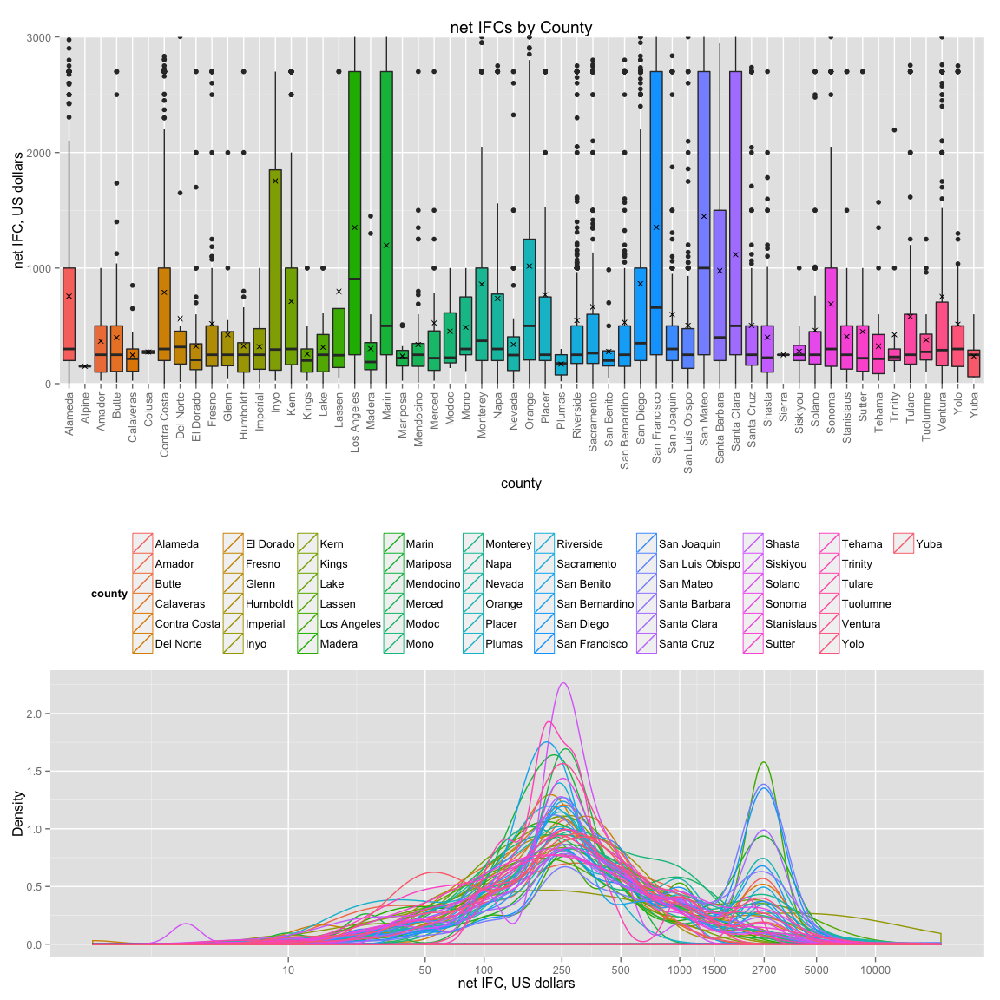

### Description Three

The comparison drawn in the plot above is the distribution of IFCs and the county of their contribution. The trend is that some counties contribute more than others. This is engaging to a wide audience because some people may have heard of these counties, or some may live in these counties, or some may know people who live in these counties. The perception is that the most populated counties might contribute the most on average, but the reality is that some of the smaller counties on average contribute more per the number of their county's contributions. The "x" in the box plots are the averages. These plots depict a lot of information concisely.

------------------------------------------------------------------------

Reflection
==========

The analysis performed were on political contributions from the state of California and for presidential candidates. I analyzed the distribution of contributions. The distributions of contributions are different when grouped per the following features: contributor, candidate's name, candidate's political party, candidate's gender, contributor's county, contributor's occupation, receipt date, and election form. I analyzed the distributions among the individual contributions and the features. I analyzed the features dependence among each other. I analyzed the variance of contributions that can be explained by a feature.

The difficulties in analysis were with incomplete data, data wrangling, and lack of numeric data. Some of the data was incomplete, and some of the data was not pertinent or redundant to analyses. Data wrangling features to reducible quantities was a challenge a couple times. I struggled with correlating the data due to lack of numerical data, but in the process I learned about depicting categorical data more intelligently to discover patterns in the data. As this was my first foray into exploratory data analysis, another difficulty that I had was coming up with an overall plan of attack. Questions would arise from examination, and more questions would arise from those questions, and at some point, you have to step back and be okay with not answering every question, less you would examine the data perpetually.

Success in analysis were using the 'dplyr' package. The 'dplyr' package allows SQL-type queries, facilitating analyses. The packages 'ggplot' and 'qplot' had a lot of customization which helped demonstrate the analyses. Some other successes were grouping the contributions by contributor to reduce negative quantities and variability in FEC accounting practices, reducing the occupation and zip code features, comparing contributor occupations by political party and candidate gender, comparing inter-activity of features among themselves and contributions. These all happen to be important decisions and how my analysis is depicted. Mutating the data otherwise would change the analyses.

The analysis performed herein could be enriched with more numeric data such as population of counties, grouping of occupation data to more than 4 entries if possible, grouping of employer data to less than 10 entries if possible, the addition of contributor's gender, and a interactive pictorial map of the counties and distributions. With these additions, one could get contribution per population, more insights on occupation and employer data and voting habits, and comparisons of candidate gender and contributor gender correlations.
